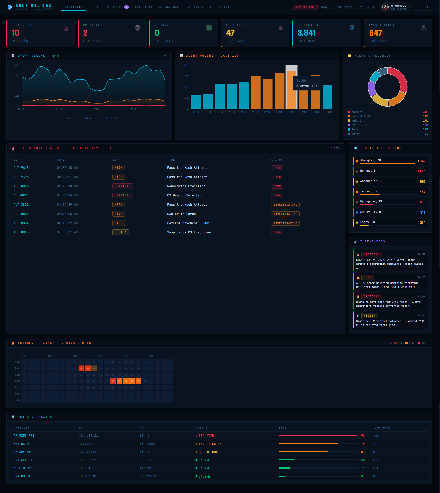
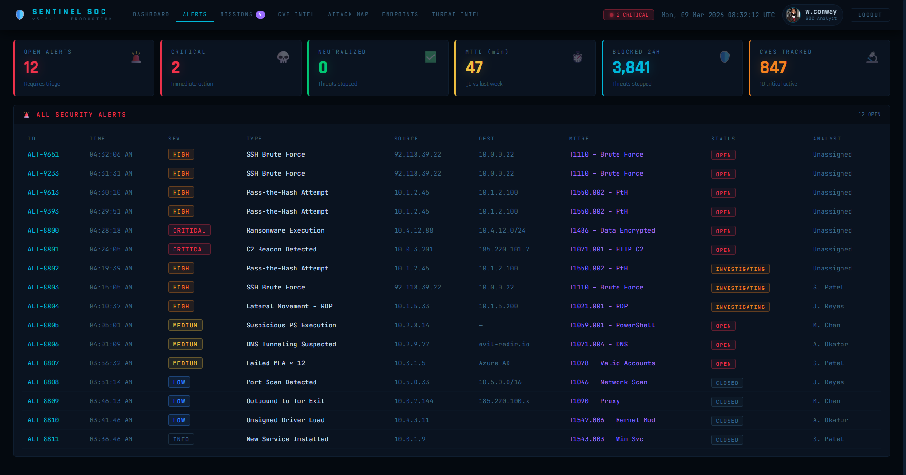
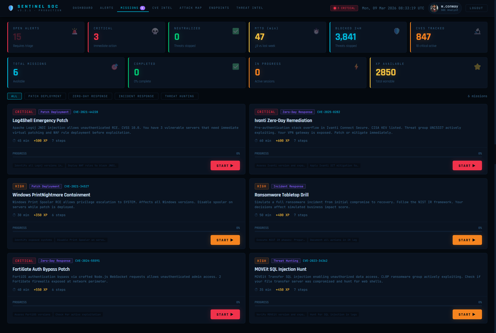
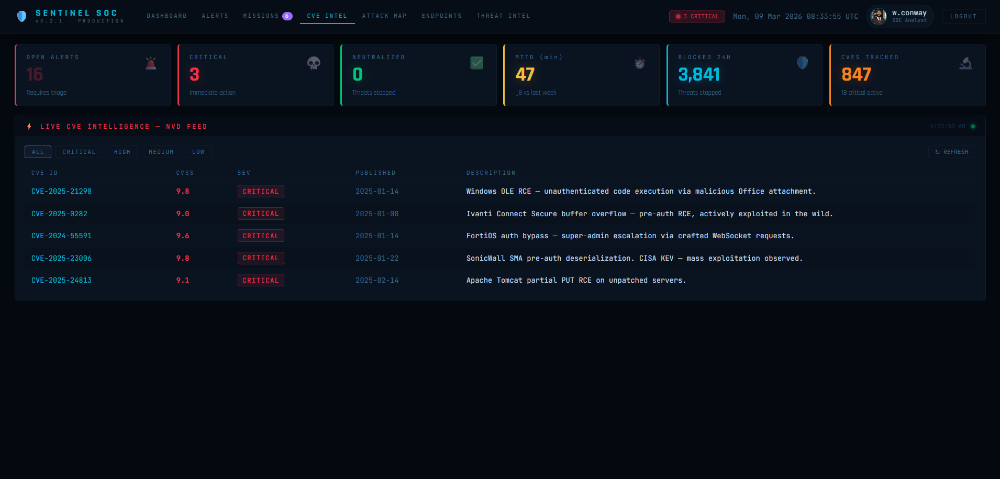
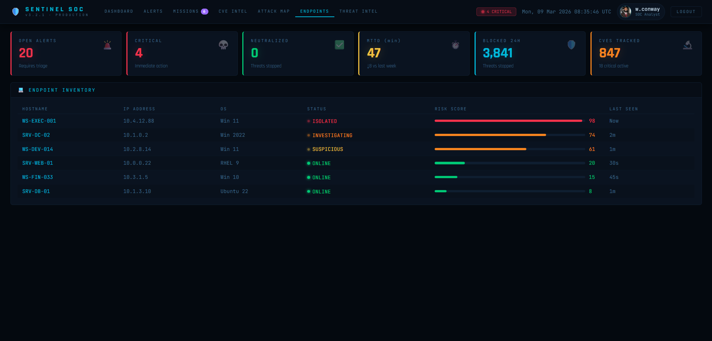
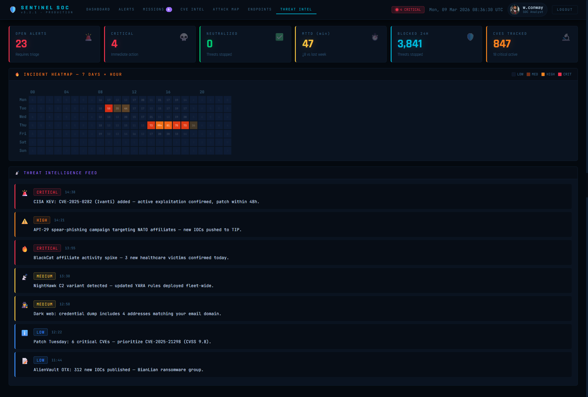

[](https://github.com/Willie-Conway/SOC-Simulator/actions/workflows/deploy.yml)

# 🛡️ SENTINEL SOC — Security Operations Center Dashboard


<p align="center">
  
  
  
  
</p>

---


### **About** 🛡️

**SENTINEL SOC** is a professional-grade Security Operations Center (SOC) dashboard that simulates real-world threat detection, investigation, and response workflows. Built with React and Recharts, it features live alert monitoring, interactive investigation playbooks with terminal-style execution, global attack maps, real-time CVE intelligence, incident heatmaps, and gamified security missions — all in a dark, cyberpunk-inspired interface designed for security analysts. Perfect for security professionals, SOC analysts, and cybersecurity students learning incident response. 🔐


---

## ✨ Key Features

### 🎯 **7 Core Modules**

| Module                       | Focus                      | Key Capabilities                                           |
| ---------------------------- | -------------------------- | ---------------------------------------------------------- |
| **01 — Dashboard**    | Real-Time Monitoring       | Live alerts, trend charts, threat feed, endpoint status    |
| **02 — Alerts**       | Alert Management           | Full alert table, filtering, investigation, neutralization |
| **03 — Missions**     | Gamified Training          | 6 security missions with step-by-step playbooks            |
| **04 — CVE Intel**    | Vulnerability Intelligence | Live NVD API feed, CVSS scoring, severity filtering        |
| **05 — Attack Map**   | Global Visualization       | Leaflet map with attack origins, severity clustering       |
| **06 — Endpoints**    | Asset Inventory            | Endpoint status, risk scoring, isolation tracking          |
| **07 — Threat Intel** | Intelligence Feed          | Real-time threat updates, IOC sharing, TTPs                |

---

## 🚨 **Module 01: Dashboard — Real-Time Monitoring**

### **Live Statistics** 📊

| Metric                               | Format  | Color     | Update     |
| ------------------------------------ | ------- | --------- | ---------- |
| **Open Alerts**                | Count   | 🔴 Red    | Real-time  |
| **Critical Alerts**            | Count   | 🔴 Red    | Real-time  |
| **Neutralized Threats**        | Count   | 🟢 Green  | Real-time  |
| **MTTD (Mean Time to Detect)** | Minutes | 🟡 Yellow | Dynamic    |
| **Blocked 24h**                | Count   | 🔵 Cyan   | Daily      |
| **CVEs Tracked**               | Count   | 🟠 Orange | API-driven |

### **Interactive Charts** 📈

- **Event Volume — 24h**: Area chart with events, alerts, critical alerts
- **Alert Volume — Last 12h**: Bar chart with severity coloring
- **Alert Categories**: Pie chart with 6 threat categories

### **Live Security Alerts** 🚨

- **Real-time alert generation** every 9 seconds
- **12 alert types** with MITRE ATT&CK mapping
- **Severity levels**: CRITICAL, HIGH, MEDIUM, LOW, INFO
- **Status tracking**: OPEN, INVESTIGATING, CLOSED, NEUTRALIZED
- **Click-to-investigate** workflow

### **Top Attack Origins** 🌍

- **7 top attack sources** with event counts
- **Severity color coding** on progress bars
- **Animated dots** for critical sources

### **Threat Feed** 📡

- **Real-time threat intelligence** updates
- **Timestamps** and severity badges
- **CISA KEV alerts**, APT campaigns, ransomware updates

### **Incident Heatmap** 🔥

- **7-day × 24-hour** incident frequency visualization
- **Color gradient** from low (dark) to critical (red)
- **Hover tooltips** with exact incident counts
- **Cell numbers** displayed for visibility

### **Endpoint Status** 💻

- **6 endpoints** with hostname, IP, OS, status, risk score
- **Risk bars** with color thresholds (red >75, orange >40, green <40)
- **Status indicators**: ISOLATED, INVESTIGATING, SUSPICIOUS, ONLINE




---

## 🔍 **Module 02: Alerts — Full Alert Management**

### **Alert Table** 📋

| Column                 | Description                           | Format              |
| ---------------------- | ------------------------------------- | ------------------- |
| **ID**           | Alert identifier                      | `ALT-8800` format |
| **Time**         | Timestamp                             | HH:MM:SS            |
| **Severity**     | CRITICAL/HIGH/MEDIUM/LOW/INFO         | Color-coded badge   |
| **Type**         | Alert category                        | 12+ types           |
| **Source IP**    | Attacker IP                           | IPv4                |
| **Destination**  | Target                                | IP or range         |
| **MITRE ATT&CK** | Technique ID                          | e.g., T1486         |
| **Status**       | OPEN/INVESTIGATING/CLOSED/NEUTRALIZED | Badge               |
| **Analyst**      | Assigned analyst                      | Name or Unassigned  |

### **Alert Details Drawer** 🗂️

- **Full alert metadata** with MITRE mapping
- **Severity badge** with custom styling
- **Investigation playbook** summary (if available)
- **Neutralized status** with green checkmark
- **Escalate button** for supervisor routing



---

## 🎮 **Module 03: Missions — Gamified Security Training**

### **6 Interactive Missions** 🎯

| Mission                               | CVE            | Severity    | XP  | Time   | Category          |
| ------------------------------------- | -------------- | ----------- | --- | ------ | ----------------- |
| **Log4Shell Emergency Patch**   | CVE-2021-44228 | 🔴 CRITICAL | 500 | 45 min | Patch Deployment  |
| **Ivanti Zero-Day Remediation** | CVE-2025-0282  | 🔴 CRITICAL | 600 | 60 min | Zero-Day Response |
| **Windows PrintNightmare**      | CVE-2021-34527 | 🟠 HIGH     | 350 | 30 min | Patch Deployment  |
| **Ransomware Tabletop Drill**   | —             | 🟠 HIGH     | 400 | 50 min | Incident Response |
| **FortiGate Auth Bypass**       | CVE-2024-55591 | 🔴 CRITICAL | 550 | 40 min | Zero-Day Response |
| **MOVEit SQL Injection Hunt**   | CVE-2023-34362 | 🟠 HIGH     | 450 | 35 min | Threat Hunting    |

### **Mission Playbooks** 📖

Each mission includes **6-7 step-by-step investigation playbooks** with:

| Element                   | Description                                      |
| ------------------------- | ------------------------------------------------ |
| **Step Label**      | Action description                               |
| **Tool**            | Security tool to use (EDR, SIEM, Firewall, etc.) |
| **Command**         | CLI command to execute                           |
| **Expected Result** | Simulation output after execution                |

### **Mission Execution** 🖥️

- **Step-by-step execution** with terminal-style output
- **Progress tracking** with step completion indicators
- **XP rewards** upon mission completion
- **Status tracking**: AVAILABLE, IN PROGRESS, COMPLETED

### **Mission Categories** 📂

- Patch Deployment
- Zero-Day Response
- Incident Response
- Threat Hunting




---

## 🔬 **Module 04: CVE Intel — Live Vulnerability Intelligence**

### **Live NVD API Integration** 🌐

- **Real-time CVE feed** from National Vulnerability Database
- **20 latest critical/high CVEs** displayed
- **Automatic refresh** every 6 hours
- **Fallback data** when API unavailable

### **CVE Table** 📋

| Column                | Description              | Format                    |
| --------------------- | ------------------------ | ------------------------- |
| **CVE ID**      | Vulnerability identifier | e.g., CVE-2025-21298      |
| **CVSS**        | Base score (0-10)        | Decimal with color coding |
| **Severity**    | CRITICAL/HIGH/MEDIUM/LOW | Color-coded badge         |
| **Published**   | Publication date         | YYYY-MM-DD                |
| **Description** | Vulnerability summary    | Truncated with ellipsis   |

### **Severity Filter** 🔍

- **Filter by**: ALL, CRITICAL, HIGH, MEDIUM, LOW
- **One-click refresh** button



---

## 🗺️ **Module 05: Attack Map — Global Visualization**

### **Leaflet Integration** 🗺️

- **CartoDB dark basemap** for cyber aesthetic
- **10 global attack origins** with severity-based markers
- **Marker size** scales with attack count
- **Pulsing effect** for CRITICAL sources

### **Attack Origins Table** 📊

- **City, Country** — Attack source location
- **Events** — Attack count with severity color
- **Severity badge** — CRITICAL/HIGH/MEDIUM/LOW
- **Coordinates** — Latitude/Longitude

### **Interactive Features** 🖱️

- **Click markers** to show attack details
- **Hover tooltips** with city and event count
- **Marker icons** with severity-based borders


---

## 💻 **Module 06: Endpoints — Asset Inventory**

### **Endpoint Table** 📋

| Column               | Description                              | Format                    |
| -------------------- | ---------------------------------------- | ------------------------- |
| **Hostname**   | Device name                              | e.g., WS-EXEC-001         |
| **IP Address** | IPv4 address                             | e.g., 10.4.12.88          |
| **OS**         | Operating system                         | Win 11, RHEL 9, Ubuntu 22 |
| **Status**     | ISOLATED/INVESTIGATING/SUSPICIOUS/ONLINE | Color-coded badge         |
| **Risk Score** | 0-100                                    | Progress bar + number     |
| **Last Seen**  | Time since last activity                 | "Now", "2m", "45s"        |

### **Status Indicators** 🟢🟠🔴

| Status                  | Color     | Action Required         |
| ----------------------- | --------- | ----------------------- |
| **ISOLATED**      | 🔴 Red    | Immediate investigation |
| **INVESTIGATING** | 🟠 Orange | Analyst assigned        |
| **SUSPICIOUS**    | 🟡 Yellow | Monitor closely         |
| **ONLINE**        | 🟢 Green  | Normal operation        |




---

## 📡 **Module 07: Threat Intel — Intelligence Feed**

### **Live Threat Feed** 📢

- **7 real-time intelligence updates** with timestamps
- **Severity badges** for each update
- **Icons** for threat categories (🚨 CISA KEV, ⚠️ APT, 🔥 Ransomware, etc.)
- **Full message text** with truncation

### **Feed Examples** 📰

```
🚨 14:38 · CISA KEV: CVE-2025-0282 (Ivanti) added — active exploitation confirmed, patch within 48h.
⚠️ 14:21 · APT-29 spear-phishing campaign targeting NATO affiliates — new IOCs pushed to TIP.
🔥 13:55 · BlackCat affiliate activity spike — 3 new healthcare victims confirmed today.
📡 13:30 · NightHawk C2 variant detected — updated YARA rules deployed fleet-wide.
```



---

## 🎨 **Design & Aesthetics**

### **Cyberpunk SOC Aesthetic** 🖥️

- **Deep black background** (`#04090f`) — maximum contrast for alerts
- **Cyan accent** (`#00b8d9`) for primary UI elements
- **Green** (`#00c875`) for success and neutralized threats
- **Red** (`#f0324b`) for critical alerts
- **Orange** (`#f5841f`) for high severity
- **Purple** (`#9b6dff`) for threat intel
- **Binary rain animation** on login screen

### **Typography** ✍️

- **Rajdhani** — Headers, KPI values, mission titles
- **JetBrains Mono** — Terminal output, alerts, tables
- **Orbitron** — Logo and special titles

### **Terminal Aesthetic** 💻

- **Monospaced fonts** for all technical data
- **Blinking cursor** in investigation terminals
- **Pulse animations** for active threats
- **Glow effects** on critical elements
- **Scanline overlays** for authenticity

### **Severity Color Coding** 🎨

| Severity           | Color  | Hex         | Usage                     |
| ------------------ | ------ | ----------- | ------------------------- |
| **CRITICAL** | Red    | `#f0324b` | Immediate action required |
| **HIGH**     | Orange | `#f5841f` | Escalate within 2h        |
| **MEDIUM**   | Yellow | `#f0c040` | Investigate within 24h    |
| **LOW**      | Blue   | `#3a8fff` | Monitor                   |
| **INFO**     | Grey   | `#3d6a8a` | Informational             |

---

## 🛠️ **Technical Implementation**

### **Tech Stack** 🥞

- **React 18** — Functional components with hooks
- **Recharts** — Interactive data visualizations
- **Leaflet** — Global attack maps
- **Custom CSS** — Cyberpunk design system
- **Context API** — Authentication state

### **React Hooks Used** 🎣

| Hook            | Purpose                                   |
| --------------- | ----------------------------------------- |
| `useState`    | 30+ state variables for UI and data       |
| `useEffect`   | API calls, map initialization, animations |
| `useRef`      | Canvas animations, map instances          |
| `useCallback` | Memoized data fetching                    |
| `useContext`  | Authentication across components          |
| `useMemo`     | Heatmap data memoization                  |

### **Key Components** 🧩

| Component                    | Purpose              | Features                                   |
| ---------------------------- | -------------------- | ------------------------------------------ |
| **BinaryRain**         | Login background     | Animated falling binary digits             |
| **InvestigationModal** | Playbook execution   | Step-by-step terminal, command simulation  |
| **AlertDrawer**        | Alert details        | Full metadata, escalate options            |
| **MissionsTab**        | Gamified training    | 6 missions with progress tracking          |
| **LeafletMap**         | Global visualization | Marker clustering, tooltips, severity dots |
| **IncidentHeatmap**    | Time-based heatmap   | 7x24 grid with hover tooltips              |
| **CVEPanel**           | Vulnerability feed   | Live NVD API integration                   |

### **Data Flow** 🔄

```
User Authentication → Dashboard
                        ↓
    ┌──────────────────┴──────────────────┐
    ↓                  ↓                  ↓
Alerts Table      Attack Map         Endpoint Status
    ↓                  ↓                  ↓
Investigation     Threat Feed        Risk Scoring
    ↓
Neutralization
```

---

## 🎥 **Video Demo Script** (60-75 seconds)

| Time | Module        | Scene          | Action                                                       |
| ---- | ------------- | -------------- | ------------------------------------------------------------ |
| 0:00 | Auth          | Login          | Binary rain background, enter credentials → Dashboard loads |
| 0:05 | Dashboard     | KPIs           | Show 8 open alerts, 3 critical, 2 neutralized                |
| 0:10 | Dashboard     | Live Alerts    | Click on CRITICAL "Ransomware Execution" alert               |
| 0:15 | Investigation | Playbook       | Step 1: Identify affected host → Run command → See output  |
| 0:20 | Investigation | Progress       | Steps 1-7 completed → Click "NEUTRALIZE THREAT"             |
| 0:25 | Dashboard     | KPI Update     | Neutralized count increases from 2 → 3                      |
| 0:30 | Missions      | Start Mission  | Launch "Log4Shell Emergency Patch"                           |
| 0:35 | Missions      | Step Execution | Run patch command → See terminal output                     |
| 0:40 | Missions      | Complete       | Mission Complete! +500 XP earned                             |
| 0:45 | Attack Map    | Global View    | Hover over Shanghai → 1,842 events, CRITICAL                |
| 0:50 | CVE Intel     | Live Feed      | Show CVE-2025-21298 with 9.8 CVSS score                      |
| 0:55 | Threat Intel  | Feed           | Scroll through 7 live updates                                |
| 1:00 | Profile       | User Menu      | Click avatar → Show profile modal                           |

---

## 🚦 **Performance**

- **Load Time**: < 2.5 seconds
- **Memory Usage**: < 80 MB
- **API Calls**: NVD CVE feed (every 6h)
- **Real-time Updates**: Simulated alerts every 9 seconds

### **Dependencies** 📦

- **React** 18
- **Recharts** 2.x
- **Leaflet** 1.9.4
- **No CSS frameworks** — Pure custom styling

---

## 🛡️ **Security Notes**

SENTINEL SOC is an **educational simulation**:

- ✅ No actual threat data transmitted
- ✅ All investigations simulated in browser
- ✅ Local storage for authentication persistence
- ✅ No real security tools affected
- ✅ Educational purposes only — learn SOC workflows safely

---

## 📝 **License**

MIT License — see LICENSE file for details.

---

## 🙏 **Acknowledgments**

- **NIST NVD** — National Vulnerability Database API
- **MITRE ATT&CK** — Threat framework and techniques
- **CISA KEV** — Known Exploited Vulnerabilities catalog
- **Leaflet** — Open-source mapping library
- **Recharts** — React charting library

---

## 📧 **Contact**

- **GitHub Issues**: [Create an issue](https://github.com/Willie-Conway/SENTINEL-SOC/issues)
- **Website**: https://willie-conway.github.io/SENTINEL-SOC/

---

## 🏁 **Future Enhancements**

- [ ] Add multi-user collaboration
- [ ] Implement real SIEM log parsing
- [ ] Add MITRE ATT&CK navigator integration
- [ ] Include threat hunting queries
- [ ] Add automated report generation
- [ ] Implement incident timeline visualization
- [ ] Add machine learning anomaly detection
- [ ] Include compliance mapping (NIST, ISO)
- [ ] Add threat actor profiling
- [ ] Implement playbook creation UI

---

<p align="center">
  <strong>🛡️ SENTINEL SOC — Security Operations Center Dashboard — Now Ready for Your Portfolio! 🛡️</strong>
p>

---

*Last updated: March 2026*
